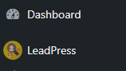

# LeadPress

This is a simple CRM plugin for WordPress

## Installation

All you need to do is clone this plugin into your `wp-content/plugins` folder of your site or you can download this plugin and paste it into your `wp-content/plugins` folder.

```
git clone https://github.com/ihossen016/server-side-pagination.git
```

## Usages

-   Now navigate to your plugins page you will find the **LeadPress** plugin in your plugins list, activate it.


-   After activating the plugin you'll find an admin menu on the left side.



## Issues

If you encounter any issues or have questions about this plugin, please feel free to [open an issue](https://github.com/ihossen016/LeadPress/issues) on GitHub.

## Author

**LeadPress** is maintained by [Ismail Hossen](https://github.com/ihossen016).

Thank you for using **LeadPress**!
